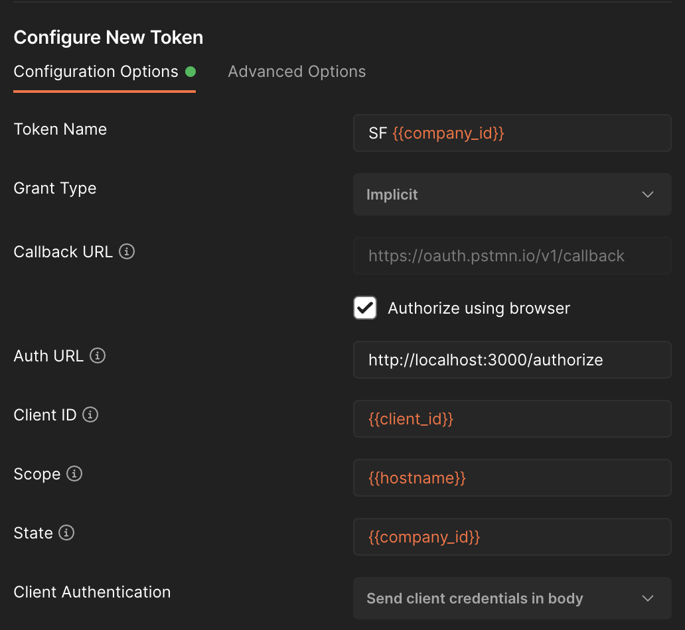

# OAuth 2.0 SAML Assertion Access Token Generator for SAP SuccessFactors HCM Suite

[](https://github.com/piejanssens/sf-oauth/releases/latest)
[](https://github.com/piejanssens/sf-oauth/actions/workflows/test.yml)
[](https://www.npmjs.com/package/sf-oauth)
[](https://www.npmjs.com/package/sf-oauth)
[](LICENSE)
[](https://www.npmjs.com/package/sf-oauth)
[](https://github.com/semantic-release/semantic-release)

This utility can generate and validate key pairs, generate SAML assertions accepted by SuccessFactors `/oauth/token` endpoint and integrate with Postman (which lacks support for the OAuth 2.0 SAML bearer assertion flow).

Features:

- [OAuth 2.0 SAML Assertion Access Token Generator for SAP SuccessFactors HCM Suite](#oauth-20-saml-assertion-access-token-generator-for-sap-successfactors-hcm-suite)
  - [Prerequisites](#prerequisites)
  - [Installation](#installation)
  - [Usage](#usage)
    - [Generate a new key pair](#generate-a-new-key-pair)
    - [Create or update the OAuth client in SuccessFactors](#create-or-update-the-oauth-client-in-successfactors)
    - [Run a web service returning OAuth access tokens](#run-a-web-service-returning-oauth-access-tokens)
    - [Usage with Postman](#usage-with-postman)
    - [Generate via CLI](#generate-via-cli)
      - [Argument Aliases](#argument-aliases)
    - [Check the OAuth client certificate's validity](#check-the-oauth-client-certificates-validity)
    - [Learning Only Users](#learning-only-users)
    - [Testing](#testing)
  - [Contributing](#contributing)
  - [Sponsorship](#sponsorship)

## Prerequisites

- Install Node.JS >= 18
- Install OpenSSL

## Installation

```shell
$ npm i -g sf-oauth
```

## Usage

> ⚠️ Once installed, you can run the command `sf-oauth` from a terminal shell. Either pass the `--dir` argument to specify the directory (to be) containing the PEM files, or run from within that directory.

### Generate a new key pair

```console
$ sf-oauth --newkeypair
...
```

Provide sensible information for the certificate, for example:

> ---
>
> Country Name (2 letter code) [AU]:BE<br>
> State or Province Name (full name) [Some-State]:Antwerp<br>
> Locality Name (eg, city) []:Antwerp<br>
> Organization Name (eg, company) [Internet Widgits Pty Ltd]:Example LTD<br>
> Organizational Unit Name (eg, section) []:HRT<br>
> Common Name (e.g. server FQDN or YOUR name) []:Pieter Janssens<br>
> Email Address []:piejanssens@example.com<br>

### Create or update the OAuth client in SuccessFactors

1. Go to OAuth Clients
2. Create new or edit an existing client
3. Provide a descriptive name - e.g. "Postman Pieter Janssens"
4. Copy the contents of `...public.pem`, paste in SF and save
5. Copy the OAuth client API key (e.g. to use as client ID in the Postman configuration)

### Run a web service returning OAuth access tokens

Run the command without any arguments:

```shell
$ sf-oauth [--port]
ℹ️  PEM files directory is set to /X/Y/Z/SF Secret Keypairs
ℹ️  Check the README.md for instructions on how this can be used in combination with Postman
🚀 SAML Assertion OAuth access token generator listening on port 3000
```

| method | path         | purpose                                                                                                                                         | body/query parameters                                                              |
| ------ | ------------ | ----------------------------------------------------------------------------------------------------------------------------------------------- | ---------------------------------------------------------------------------------- |
| GET    | `/authorize` | requests to supply identifier via your browser, generates SAML assertion, requests OAuth access token from SF and then returns the access token | `client_id`, `scope`, `state`, `learning_only` (optional)                          |
| POST   | `/authorize` | immediately generates SAML assertion, requests OAuth access token from SF and then returns the access token                                     | `user_id` or `username`, `client_id`, `scope`, `state`, `learning_only` (optional) |

- `user_id`: SuccessFactors _userId_
- `username`: SuccessFactors _username_ (alternative to user_id)
- `client_id`: SuccessFactors OAuth client API key
- `scope`: SuccessFactors hostname
- `state`: SuccessFactors _companyId_
- `redirect_uri`: OAuth callback URL (optional)
- `learning_only`: Set to `true` or `on` to generate assertions for learning-only users (optional)

> ℹ️ The naming of these parameters might seem strange at first, but this is chosen to align with the parameters being sent in the implicit OAuth flow from Postman.

> ⚠️ If a specific keypair with the name '<companyId>-public.pem' and '<companyId>-private.pem' is present, this will be used to generate the SAML assertion. If not, by default it will use 'public.pem' and 'private.pem'.

### Usage with Postman


For each SF instance, create a separate Postman environment specifying the following variables:

- hostname: hostname of SF API
- company_id: SF instance ID
- client_id: SuccessFactors OAuth client API key

In any collection or folder, set up 'Authorization' to `OAuth 2.0` and configure the like shown as follows:



> **Remember** to select the correct Postman environment prior to requesting a new OAuth access token. As long as the token remains valid you can select different tokens that are held by Postman without the need to generate/request a new one.

### Generate via CLI

```shell
$ sf-oauth --generate --companyId <SF Company ID> --hostname <SF API hostname> --clientId <OAuth client API key> --userId <userId|username> [--ttl <assertion validity in seconds>] [--learningOnly]

SAML Assertion...

base64 encoded SAML Assertion
```

Optional parameters:

- `--ttl`: validity of the assertion in seconds (600 by default)
- `--validate`: will request a bearer access token and validate it on by calling the SF OData API, this requires the argument `--companyId` to be provided as well.
- `--raw`: will output the base64 encoded string only. This can be used in scripting or piping. For example 🪄 `$ sf-oauth --generate --companyId ... --raw | base64 -d`

Example of generating a SAML assertion, requisting an access token with it and finally testing the access token by calling the SuccessFactors OData API:

```shell
$ sf-oauth --generate --companyId salesDemoXYZ --hostname apisalesdemo2.successfactors.eu --clientId NzNkYzk0NTljMTQ0NWEyOWMxNzUwYjdhOTdkOA --username piejanssens@example.com  --ttl 3600 --validate
Requesting a SAML Bearer token...
Bearer token received 🎉
{
  access_token: 'eyJ0b2tlbkNvbnRlbnQiOnsiYXBpS2V5IjoiTnpOa1l6azBOVGxqTVRRME5XRXlPV014TnpVd1lqZGhPVGRrT0EiLCJzZlByaW5jaXBsZSI6IjEwMzI2NiNESVYjU0ZDUEFSVDAwMDUxMiIsImlzc3VlZEZvciI6InBqX25vZGVqcyIsInNjb3BlIjoiIiwiaXNzdWVkQXQiOjE2NDc1MTI0NDU4OTIsImV4cGlyZXNBdCI6MTY0NzU5ODg0NTg5Mn0sInNpZ25hdHVyZSI6IklQSTEvbGh3dGtIeXFQTml0bzNIL05DL3hzSjFSMHBYM3hMOCt0RWlFN29OYnhveFVOc1lUOUlyMnorZlUxN0JEcFc2eWhHU1dPaERHRjJjUTQ3dVZGNHJGLzd2cXRPTlZGbWdvK2NGTDBNSUsxS1Axck1BK29DM0paU1ZOL2RTaWFzWXJUb1BrdnBkZ3BGcHN0U2VYc3lvajFxWTdVL1daSllhbDZzakd4WT0ifQ==',
  token_type: 'Bearer',
  expires_in: 85949
}
Validating the token...
Token is valid  🎉
```

#### Argument Aliases

| alias | argument       |
| ----- | -------------- |
| -g    | --generate     |
| -n    | --newkeypair   |
| -c    | --clientId     |
| -u    | --userId       |
| -U    | --username     |
| -i    | --companyId    |
| -h    | --hostname     |
| -v    | --validate     |
| -t    | --ttl          |
| -p    | --port         |
| -r    | --raw          |
| -d    | --dir          |
| -l    | --learningOnly |

### Check the OAuth client certificate's validity

```shell
$ sf-oauth --validate [--companyId]
notAfter=Mar  6 13:37:03 2032 GMT
```

### Learning Only Users

The SuccessFactors Learning OAuth token server is deprecated. Instead, you can use the SuccessFactors Platform token server to generate OAuth tokens even if the user does not exist in Employee Profile or Employee Central, a so-called learning-only user.

**Via CLI:** Use the `-l` or `--learningOnly` argument.

**Via Web Form:** When using the `/authorize` endpoint, check the "Learning Only User" checkbox.

Example:
```shell
$ sf-oauth --generate --companyId salesDemoXYZ --hostname apisalesdemo2.successfactors.eu --clientId <key> --userId <user> --learningOnly
```

### Testing

Run the automated tests locally with:

```shell
npm test
```

The test suite uses dummy key pairs stored in `test/fixtures/*.pem` for assertion generation tests.

GitHub Actions runs the same test command on every pull request and on pushes to `master`.

## Contributing

Contributions are more than welcome! Please open an issue or a pull request.

ℹ️ To be able to execture the Node cli commands on your forked source code, run `npm link` from the root folder project.

## Sponsorship

[](https://ko-fi.com/M4M7694D5)
