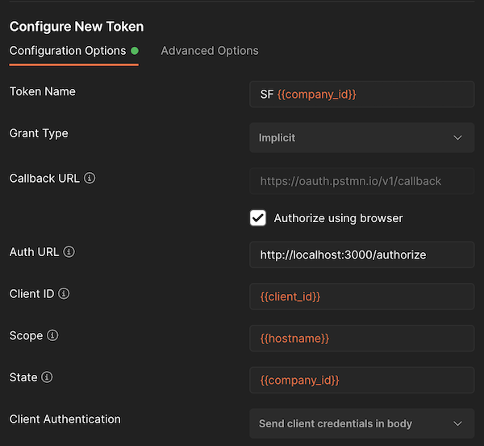

# OAuth 2.0 SAML Assertion Access Token Generator for SAP SuccessFactors HXM Suite

This utility can generate and validate key pairs, generate SAML assertions accepted by SuccessFactors `/oauth/token` endpoint and integrate with Postman (which lacks support for the OAuth 2.0 SAML bearer assertion flow).

Features:

- [Generate a new key pair](#generate-a-new-key-pair)
- [Check certificate validtity](#check-the-oauth-client-certificates-validity)
- [Generate assertion (and validate)](#generate-via-cli)
- [Run a local web service to generate an assertion and provide access tokens](#run-a-web-service-returning-oauth-access-tokens)
- [Integrate with a Postman OAuth flow to obtain an access token](#usage-with-postman)

## Prerequisites

- Install Node.JS >= 18
- Install OpenSSL

## Installation

```shell
$ npm i -g sf-oauth
```

## Usage

> ⚠️ Once installed, you can run the command `sf-oauth` from a terminal shell. Either pass the `--dir` argument to specify the directory (to be) containing the PEM files, or run from within that directory.

### Generate a new key pair

```console
$ sf-oauth --newkeypair
...
```

Provide sensible information for the certificate, for example:

> ---
>
> Country Name (2 letter code) [AU]:BE<br>
> State or Province Name (full name) [Some-State]:Antwerp<br>
> Locality Name (eg, city) []:Antwerp<br>
> Organization Name (eg, company) [Internet Widgits Pty Ltd]:Example LTD<br>
> Organizational Unit Name (eg, section) []:HRT<br>
> Common Name (e.g. server FQDN or YOUR name) []:Pieter Janssens<br>
> Email Address []:piejanssens@example.com<br>

### Create or update the OAuth client in SuccessFactors

1. Go to OAuth Clients
2. Create new or edit an existing client
3. Provide a descriptive name - e.g. "Postman Pieter Janssens"
4. Copy the contents of `...public.pem`, paste in SF and save
5. Copy the OAuth client API key (e.g. to use as client ID in the Postman configuration)

### Run a web service returning OAuth access tokens

Run the command without any arguments:

```shell
$ sf-oauth [--port]
ℹ️  PEM files directory is set to /X/Y/Z/SF Secret Keypairs
ℹ️  Check the README.md for instructions on how this can be used in combination with Postman
🚀 SAML Assertion OAuth access token generator listening on port 3000
```

You can call th

| method | path         | purpose                                                                                                                                       | body/query parameters                    |
| ------ | ------------ | --------------------------------------------------------------------------------------------------------------------------------------------- | ---------------------------------------- |
| GET    | `/authorize` | requests to supply `userId` via your browser, generates SAML assertion, requests OAuth access token from SF and then returns the access token | `client_id`, `scope`, `state`            |
| POST   | `/authorize` | immediatly generates SAML assertion, requests OAuth access token from SF and then returns the access token                                    | `user_id`, `client_id`, `scope`, `state` |

- `user_id`: SuccessFactors _userId_
- `client_id`: SuccessFactors OAuth client API key
- `scope`: SuccessFactors hostname
- `state`: SuccessFactors _companyId_
- `redirect_uri`: OAuth callback URL (optional)

> ℹ️ The naming of these parameters might seem strange at first, but this is chosen to align with the parameters being sent in the implicit OAuth flow from Postman.

> ⚠️ If a specific keypair with the name '<companyId>-public.pem' and '<companyId>-private.pem' is present, this will be used to generate the SAML assertion. If not, by default it will use 'public.pem' and 'private.pem'.

### Usage with Postman


For each SF instance, create a separate Postman environment specifying the following variables:

- hostname: hostname of SF API
- company_id: SF instance ID
- client_id: SuccessFactors OAuth client API key

In any collection or folder, set up 'Authorization' to `OAuth 2.0` and configure the like shown as follows:



> **Remember** to select the correct Postman environment prior to requesting a new OAuth access token. As long as the token remains valid you can select different tokens that are held by Postman without the need to generate/request a new one.

### Generate via CLI

```shell
$ sf-oauth --generate --companyId <SF Company ID> --hostname <SF API hostname> --clientId <OAuth client API key> --userId <userId> [--ttl <assertion validity in seconds>]

SAML Assertion...

base64 encoded SAML Assertion
```

Optional parameters:

- `--ttl`: validity of the assertion in seconds (600 by default)
- `--validate`: will request a bearer access token and validate it on by calling the SF OData API, this requires the argument `--companyId` to be provided as well.
- `--raw`: will output the base64 encoded string only. This can be used in scripting or piping. For example 🪄 `$ sf-oauth --generate --companyId ... --raw | base64 -d`

Example of generating a SAML assertion, requisting an access token with it and finally testing the access token by calling the SuccessFactors OData API:

```shell
$ sf-oauth --generate --companyId salesDemoXYZ --hostname apisalesdemo2.successfactors.eu --clientId NzNkYzk0NTljMTQ0NWEyOWMxNzUwYjdhOTdkOA --username piejanssens@example.com  --ttl 3600 --validate
Requesting a SAML Bearer token...
Bearer token received 🎉
{
  access_token: 'eyJ0b2tlbkNvbnRlbnQiOnsiYXBpS2V5IjoiTnpOa1l6azBOVGxqTVRRME5XRXlPV014TnpVd1lqZGhPVGRrT0EiLCJzZlByaW5jaXBsZSI6IjEwMzI2NiNESVYjU0ZDUEFSVDAwMDUxMiIsImlzc3VlZEZvciI6InBqX25vZGVqcyIsInNjb3BlIjoiIiwiaXNzdWVkQXQiOjE2NDc1MTI0NDU4OTIsImV4cGlyZXNBdCI6MTY0NzU5ODg0NTg5Mn0sInNpZ25hdHVyZSI6IklQSTEvbGh3dGtIeXFQTml0bzNIL05DL3hzSjFSMHBYM3hMOCt0RWlFN29OYnhveFVOc1lUOUlyMnorZlUxN0JEcFc2eWhHU1dPaERHRjJjUTQ3dVZGNHJGLzd2cXRPTlZGbWdvK2NGTDBNSUsxS1Axck1BK29DM0paU1ZOL2RTaWFzWXJUb1BrdnBkZ3BGcHN0U2VYc3lvajFxWTdVL1daSllhbDZzakd4WT0ifQ==',
  token_type: 'Bearer',
  expires_in: 85949
}
Validating the token...
Token is valid  🎉
```

#### Argument Aliases

| alias | argument     |
| ----- | ------------ |
| -g    | --generate   |
| -n    | --newkeypair |
| -c    | --clientId   |
| -u    | --userId     |
| -i    | --companyId  |
| -h    | --hostname   |
| -v    | --validate   |
| -t    | --ttl        |
| -p    | --port       |
| -r    | --raw        |
| -d    | --dir        |

### Check the OAuth client certificate's validity

```shell
$ sf-oauth --validate [--companyId]
notAfter=Mar  6 13:37:03 2032 GMT
```

## Contributing

Contributions are more than welcome! Please open an issue or a pull request.

ℹ️ To be able to execture the Node cli commands on your forked source code, run `npm link` from the root folder project.

## Sponsorship

[](https://ko-fi.com/M4M7694D5)
